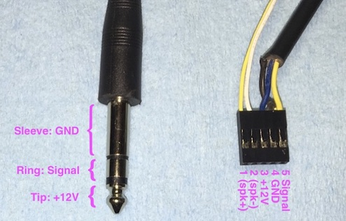
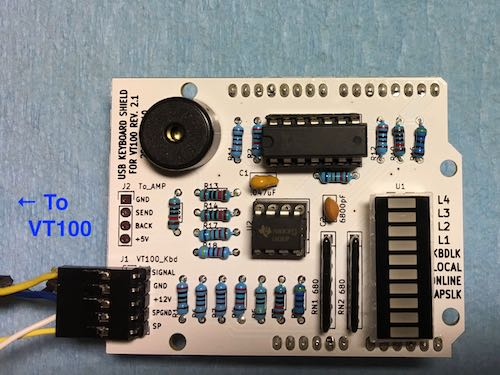
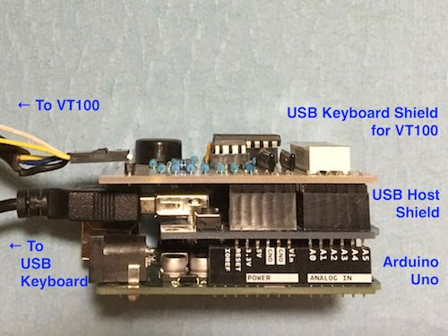

# USB Keyboard Shield for VT100 #

__Rev. 2.1__

## About

USB Keyboard Shield for VT100 connects a standard USB keyboard to Digital's VT100 terminal.

Features:

* All keys on the VT100 keyboard are mapped to the USB keyboard keys.
* VT100 keyboard LED's and bell are implemented on the shield.

The Gerber file, BOM, schematic and Arduino sketch for the shield are included in the project folder. The steps to assemble, program and connect the shield are described in this document.

This shield requires the USB Host Shield by Circuits@Home.

Please use the information in this project at your own risk. No warranty or guarantee is provided.

## Required Components

- USB Keyboard Shield for VT100 (the shield from this project)
- [USB Host Shield by Circuits@Home](https://www.circuitsathome.com/arduino_usb_host_shield_projects/), the "full-sized board"
- Arduino Uno
- Keyboard cable for VT100 (see "Keyboard Cable" below)
- USB Keyboard

## Required Steps

1. Assemble the shield
2. Make a keyboard cable
3. Program the Arduino
4. Connect the shields and cables

Details are described below.

## Shield Assembly

USB Keyboard Shield for VT100 can be assembled using the following info:

- PCB Gerber File: [usbkbd_vt100_2_1_gerber.zip](./usbkbd_vt100_2_1_gerber.zip)
- BOM: [usbkbd_vt100_BOM_2_1.pdf](./usbkbd_vt100_BOM_2_1.pdf)

## Keyboard Cable

To make the keyboard cable, connect these components:

 - 1/4 inch stereo plug/cable
 - 5-pin header connector

__PIN CONNECTION__

| Pin | Plug |  Value |
|-|-|-|
| 1* | - | (spk+)* |
| 2* | - | (spk-)* |
| 3 | Tip | +12V |
| 4 | Sleeve | GND |
| 5 | Ring | Signal |

  \* optional

The pin connector is attached to J1 header on the USB Keyboard shield for VT100. The stereo plug is connected to the keyboard port on VT100 terminal.





## Programming Arduino

It is recommended to program the Arduino before attaching the shields.

1. Install [USB Host Shield Library 2.0](https://github.com/felis/USB_Host_Shield_2.0) and [Timer1 Library](http://playground.arduino.cc/Code/Timer1) into Arduino IDE.

2. Clone or download this project.

3. Open the sketch `usbkeyboardvt100/usbkeyboardvt100.ino` in Arduino IDE, and program the Arduino.

### Configuration Options

There are two options in `usbkeyboardvt100.ino`:
```
// SWAPCAPS: If defined, LeftCtrl and CapsLock are swapped on USB Keyboard.
#define SWAPCAPS

// SWAPLFBAR: If defined, swap LineFeed and '|\' key codes for VT100.
//#define SWAPLFBAR
```

Comment out/uncomment the `#define` lines as needed.

## Shield and Cable Connection

1. Connect the USB keyboard to the USB connector on USB Host Shield.
2. Connect the keyboard cable for VT100 to J1 header on USB Keyboard Shield for VT100.
3. Connect the keyboard cable to the keyboard port on VT100 terminal.
4. Stack and connect Arduino Uno, USB Host Shield, and USB Keyboard Shield for VT100, in this order, from the bottom to the top.
5. No external power supply is needed. The VT100 keyboard cable conveys the power.



## Key Mapping

Some hard-to-guess keys:

| VT100 Key | USB Keyboard Key |
|-|-|
| SET UP | F1, SysRq |
| CTRL | Caps Lock |
| CAPS LOCK | Left Ctrl |
| BREAK | Break |
| LINE FEED | End |
| NO SCROLL | Scroll Lock |
| PF1 | Num Lock, F9 |
| PF2 | (pad) /, F10 |
| PF3 | (pad) *, F11 |
| PF4 | Page Up, F12 |
|(pad) , | (pad) + |

The key mapping is defined in `usb_key_tbl[]` in `usbkeyboardvt100.h`. Also see "Configuration Options" above.

## Reference Configuration

The following configuration is used in developing the shield:

- USB Host Shield 2.0
- Arduino Uno R3
- VT100-WA
- USB Keyboards: HP K1500 and Logitech K310

## Known Issues

1. When the VT100 terminal is turned off, a short beep may be generated on the shield.
2. Keyboard connected via a USB hub is not supported.

## GPL

The code is released under the GNU General Public License.
